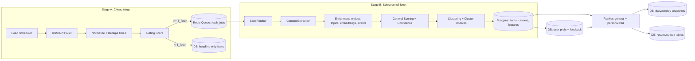

# AI News Engine Implementation Plan
*Buildable backend engine for “AI news digest + significance scoring + personalization” (English + Chinese, global coverage with US/China emphasis). Frontend out of scope.*

---

## 0) Product requirements distilled into engineering constraints

### Must deliver
1. **Daily morning run:** “Most updated AI news of the day” (high freshness, personalized).
2. **Weekly run:** “Most significant AI news of the week” (high significance, consolidated clusters).
3. **Intraday urgent updates:** push-worthy alerts when **general significance** is very high (optionally gated by user personalization).

### Hard constraints
- **Prefer free/low-setup ingestion**: RSS/Atom and public APIs first; minimal scraping.
- **Two-stage pipeline**:
  - **Stage A (cheap triage)** uses headlines + metadata only.
  - **Stage B (expensive fetch/parse)** happens only when Stage A predicts it’s worth it.
- Two scores:
  - **General significance (global importance)**
  - **Personal/domain significance (user-weighted)**
- Only items above thresholds are returned (threshold depends on user + mode).
- System must decide what’s worth fully fetching/parsing.

### Non-goals
- No UI/Frontend.
- No containerization instructions.
- No “magic AI”: every ML/LLM step must have defined inputs/outputs, validation, cost caps, and fallbacks.

---

## 1) High-level architecture

### 1.1 Components (minimal, scalable)
- **PostgreSQL** (primary DB) + **pgvector** (semantic clustering)
- **Redis** (queue + caching)
- **Python services**:
  1. `scheduler` (periodic jobs)
  2. `stage_a_poller` (RSS/API polling + gating)
  3. `stage_b_worker` (fetch → extract → enrich → score → cluster)
  4. `ranker` (produces per-user ranked outputs and digests; can be a library used by an API or a cron job)
  5. `notifier` (writes eligible alerts to an outbox; delivery handled elsewhere)

### 1.2 Data flow


---

## 2) Storage schema (Postgres + pgvector)

> The schema below is deliberately “boring SQL” and production-friendly. It supports incremental ingestion, clustering, scoring, personalization, and digests.

### 2.1 Core tables

#### `sources`
- Stores metadata about each publisher/source.
- Enables authority/credibility weighting.

Fields:
- `source_id` (PK)
- `name`
- `root_domain`
- `language` (`en`, `zh`, `multi`)
- `region` (`US`, `CN`, `EU`, `Global`, …)
- `tier` (int 0–3: 3=primary/official, 2=major reputable, 1=ok niche, 0=untrusted/experimental)
- `is_primary` (bool) — official lab blogs, pressrooms, arXiv, GitHub releases
- `license_notes` (text) — internal compliance notes

#### `feeds`
- Defines how to ingest from RSS/Atom or API endpoints.

Fields:
- `feed_id` (PK)
- `source_id` (FK)
- `feed_type` (`rss`, `atom`, `json_api`, `html_index`)
- `url`
- `priority` (int 0–100)
- `min_poll_seconds` (e.g. 300)
- `max_poll_seconds` (e.g. 43200)
- `poll_seconds` (current adaptive interval)
- `next_due_at`
- `etag` (nullable)
- `last_modified` (nullable)
- `last_polled_at`
- `error_count`
- `disabled` (bool)

#### `raw_items`
- Stores the raw feed entries (headline-level) from Stage A.

Fields:
- `raw_item_id` (PK)
- `feed_id` (FK)
- `source_id` (FK)
- `title`
- `url`
- `canonical_url`
- `published_at`
- `language` (`en`/`zh`)
- `summary_snippet` (from RSS if present; keep short)
- `content_hash_headline` (hash of normalized title+domain+date bucket)
- `stage_a_features` (JSONB)
- `gating_score` (float)
- `fetch_state` (`queued`, `skipped`, `fetched`, `failed`)
- `created_at`

Indexes:
- unique(`canonical_url`) where not null
- index on (`published_at`), (`gating_score`), (`fetch_state`)

#### `items`
- Stage B enriched items (full extraction, embeddings, events).

Fields:
- `item_id` (PK)
- `raw_item_id` (FK)
- `source_id`
- `title`
- `canonical_url`
- `published_at`
- `language`
- `extracted_text` (text, optional if licensing concerns)
- `extracted_text_sha256` (for dedupe)
- `extraction_quality` (0–1)
- `summary` (text, short)
- `summary_en` (optional translation if item is zh; used for consistent clustering/personalization)
- `entities` (JSONB: canonical entity IDs)
- `topics` (JSONB)
- `events` (JSONB: structured event extraction)
- `embedding` (vector)  ← pgvector
- `confidence` (0–1)
- `item_significance` (0–10)
- `cluster_id` (FK nullable until clustered)
- `created_at`

Indexes:
- HNSW/IVFFlat index on `embedding`
- index on (`cluster_id`), (`published_at`), (`item_significance`)

#### `clusters`
- Cluster is the unit of ranking in user-facing outputs.

Fields:
- `cluster_id` (PK)
- `cluster_title` (representative)
- `cluster_summary` (short)
- `languages` (JSONB set)
- `first_seen_at`
- `last_seen_at`
- `item_count`
- `source_count`
- `independent_domain_count`
- `primary_source_present` (bool)
- `cluster_embedding` (vector) (centroid)
- `cluster_confidence` (0–1)
- `cluster_significance` (0–10)
- `feature_agg` (JSONB) — aggregated signals (velocity, magnitude, engagement)
- `created_at`
- `updated_at`

Indexes:
- index on (`cluster_significance`), (`last_seen_at`)

#### `cluster_items`
- Many-to-one mapping items → cluster.

Fields:
- `cluster_id` (FK)
- `item_id` (FK)
- `added_at`
Primary key: (`cluster_id`, `item_id`)

#### `users`
Fields:
- `user_id` (PK)
- `created_at`
- `default_language` (`en`, `zh`, `both`)
- `geo_focus` (JSONB, e.g. weights for US/CN/EU)
- `notify_policy` (JSONB)
- `thresholds` (JSONB) — mode thresholds (daily/weekly/urgent)

#### `user_prefs`
Explicit preferences (versioned).
Fields:
- `user_id` (FK)
- `topic_weights` (JSONB: `{topic: weight}` in [-2, +2])
- `entity_follow` (JSONB list of entity_ids)
- `entity_block` (JSONB list)
- `source_allow` (JSONB list)
- `source_block` (JSONB list)
- `rumor_tolerance` (0–1)
- `novelty_vs_coverage` (0–1)
- `updated_at`

#### `user_events`
Implicit feedback stream.
Fields:
- `event_id` (PK)
- `user_id`
- `cluster_id` (nullable) / `item_id` (nullable)
- `event_type` (`open`, `click`, `save`, `share`, `hide`, `dismiss_alert`, `report_spam`)
- `dwell_ms` (nullable)
- `created_at`

#### `user_affinity`
Derived user model (fast personalization).
Fields:
- `user_id` (PK)
- `topic_affinity` (JSONB)
- `entity_affinity` (JSONB)
- `source_affinity` (JSONB)
- `updated_at`

#### `rank_snapshots`
Stores precomputed global ranks for time windows.
Fields:
- `snapshot_id` (PK)
- `window_type` (`daily`, `weekly`, `urgent_window`)
- `window_start`
- `window_end`
- `ranked_cluster_ids` (JSONB ordered list)
- `created_at`

#### `outbox_alerts`
Outbox pattern: write alert records; delivery system consumes.
Fields:
- `alert_id` (PK)
- `cluster_id`
- `created_at`
- `min_general_score`
- `min_confidence`
- `reason` (JSONB)
- `status` (`pending`, `sent`, `suppressed`)

---

## 3) Ingestion strategy (free/low-setup first)

### 3.1 Source types and how we treat them
1. **RSS/Atom feeds** (preferred): cheap, stable, low legal risk.
2. **Public APIs**: GitHub, HN Algolia, arXiv, OpenAlex, Semantic Scholar, Hugging Face.
3. **HTML index pages** (last resort): only for sources with no RSS; enforce strict politeness and ToS checks.

### 3.2 Practical baseline connector set (start here)

#### Research
- arXiv subject RSS feeds (daily updates). arXiv states RSS feeds are available for active subject areas and updated daily at midnight ET.  
  Use categories: `cs.AI`, `cs.LG`, `cs.CL`, `cs.CV`, `stat.ML`, plus optional `cs.RO`, `cs.SI`.  
  (Docs: arXiv RSS help and re-implementation notes.)

#### Open-source / tooling
- GitHub API for:
  - repo releases for a curated list of AI infra repos (PyTorch, Transformers, vLLM, llama.cpp, etc.)
  - search-based trending proxy (see §3.4).
  GitHub REST API rate limits: unauthenticated 60 req/hr; authenticated typically 5,000 req/hr.  

- Hugging Face Hub API:
  - new model uploads in key orgs
  - trending models/papers endpoints (via Hub API / OpenAPI)
  Hugging Face publishes rate limit headers/policies.

#### Community trend signals
- Hacker News via Algolia Search API (public, near-real-time indexing).  
  Use to detect *velocity/attention* signals and to bootstrap discovery.

#### Global scholarly metadata (optional but useful)
- OpenAlex:
  - paper metadata and linking by DOI/arXiv id
  - citation/venue signals (lagging but useful for “week significance”)
  Note: As of Feb 13, 2026 an API key is required; free keys allow 100,000 credits/day (and max 100 rps).  
  Treat OpenAlex as *enrichment*, not primary ingestion.

- Semantic Scholar:
  - additional metadata, citation counts, fields of study, influential citations
  Note: unauth is shared; using an API key grants dedicated 1 request per second baseline.

#### China-focused AI tech media (RSS-first, scraping-minimal)
- Prefer sites with RSS endpoints (WordPress sites often have `/feed`).
- If a site is protected by heavy anti-bot, treat as “best-effort” and do not rely on it for freshness.

> The engine is source-agnostic: you can drop in a feed URL and the scheduler adapts.

### 3.3 Feed scheduler (critical for “freshness without wallet burn”)

#### Design
- Maintain `feeds.next_due_at`.
- Poll only “due” feeds.
- Use **conditional GET**:
  - Send `If-None-Match` with ETag and `If-Modified-Since` with Last-Modified.
- Use adaptive poll interval per feed:
  - If feed produced new items last poll: decrease interval (down to min)
  - If no new items: increase interval (up to max)
  - Add jitter (±10%) to avoid thundering herd

#### Adaptive interval update (example)
- On success:
  - `new_items > 0` → `poll_seconds = max(min_poll, poll_seconds * 0.7)`
  - `new_items == 0` → `poll_seconds = min(max_poll, poll_seconds * 1.15)`
- On failure:
  - `error_count += 1`
  - `poll_seconds = min(max_poll, poll_seconds * (2 ** min(error_count, 4)))`

#### Priorities
Split feeds into tiers:
- **Tier 0 (urgent loop):** official labs, major tech outlets, HN signal APIs, GitHub releases. Poll every 5–10 minutes.
- **Tier 1 (baseline loop):** general AI/tech RSS. Poll 15–60 minutes.
- **Tier 2 (slow loop):** arXiv daily, funding databases, low-frequency blogs. Poll 6–24 hours.

### 3.4 “Trending GitHub” without scraping GitHub Trending
GitHub Trending has no official API; scraping is brittle. Use a **search proxy**:

Every 3 hours:
- Query GitHub Search API for repositories:
  - created in last X days AND stars >= Y
  - keywords: “llm”, “transformer”, “diffusion”, “rag”, “agent”, “inference”, “vllm”, “qwen”, “deepseek”, plus Chinese keywords
- Track star count over time in `repo_metrics` table:
  - `stars_delta_24h`
  - `forks_delta_24h`
- Treat high deltas as “adoption signal” features.

This yields “trending projects” with free API calls inside rate limits.

---

## 4) Stage A: headline triage (“worth fetching?”)

### 4.1 Normalize + dedupe (cheap)
For each feed entry:
1. Canonicalize URL:
   - strip UTM parameters
   - normalize scheme/host
   - resolve known redirectors if cheap (optional)
2. Compute `content_hash_headline = sha256(normalize(title) + root_domain + date_bucket)`
3. If `canonical_url` already exists in `raw_items`, skip.
4. If headline hash appears frequently in last 24h from same domain, treat as duplicate/republish and downrank.

### 4.2 Cheap features for gating (computed from metadata only)
Store in `raw_items.stage_a_features`:

- `source_tier` ∈ {0,1,2,3}
- `ai_relevance_kw` ∈ [0,1] keyword hit score (EN+ZH)
- `ai_relevance_embed` ∈ [0,1] title embedding similarity to AI anchors
- `freshness` ∈ [0,1] (half-life decay on age)
- `magnitude_hint` ∈ [0,1] presence of:
  - funding patterns ($, 亿, 万, “Series A”, “融资”)
  - model release verbs (“release”, “open-source”, “发布”, “开源”)
  - policy verbs (“regulation”, “ban”, “法案”, “监管”)
- `primary_hint` ∈ {0,1} if source is primary/official
- `lang` (en/zh)
- `url_type_hint` (paper/github/pr/normal)

> Title embeddings can be done with a small multilingual sentence transformer locally (fast, CPU OK).

### 4.3 Gating score (cheap approximation)
Compute:
```
gating_score =
  0.35 * source_tier_norm +
  0.25 * ai_relevance_embed +
  0.20 * ai_relevance_kw +
  0.10 * magnitude_hint +
  0.10 * freshness +
  0.15 * primary_hint
```
Where `source_tier_norm = source_tier / 3`.

#### Gating thresholds
- `T_fetch` (send to Stage B queue): default 0.55
- `T_watch` (store headline-only, eligible for later promotion): default 0.35

Behavior:
- `gating >= T_fetch` → queue Stage B
- `T_watch <= gating < T_fetch` → store headline-only; may be promoted later if corroboration grows
- `< T_watch` → store minimal (or drop), depending on storage budget

### 4.4 Promotion logic (“headline-only becomes important”)
Every 10 minutes:
- form provisional clusters from headline-only items using title embedding similarity (cheap).
- if a provisional cluster crosses any threshold:
  - `weighted_coverage >= C1` OR
  - `hn_trending == True` OR
  - `primary_source_present == True`
- then pick the **best representative URL** and queue Stage B fetch.

This prevents missing “quiet but important” stories that start small.

---

## 5) Stage B: full fetch, extraction, enrichment

### 5.1 Safe fetcher (security-critical)
Rules:
- allow schemes: `http`, `https`
- block private IPs / link-local / localhost (SSRF protection)
- max response size (e.g. 3–5 MB)
- timeout (connect 3s, read 10s)
- respect robots.txt for domains in `sources` unless explicitly allowed
- per-domain rate limiter (token bucket)

Store fetch metadata:
- HTTP status
- final URL after redirects
- content-type
- bytes downloaded

### 5.2 Extraction
Prefer high-precision extraction libraries:
- `trafilatura` (multilingual, robust)
- fallback: `readability-lxml` + `BeautifulSoup`

Compute:
- `extraction_quality` (heuristic):
  - length bounds (e.g. 800–50k chars)
  - ratio of boilerplate markers
  - presence of repeated nav text
If quality is low:
- fall back to RSS snippet only; still allow scoring via corroboration signals.

### 5.3 Enrichment steps (structured and cheap-first)
**Order matters**: do cheap deterministic extraction first; use LLM only for top items.

1. **Language detection** (fast library) if not known.
2. **Embedding**
   - embed `title + summary_snippet` if extraction failed
   - embed `title + extracted_text[:N]` if succeeded
   - Use multilingual embedding model so zh/en cluster together.
3. **Entity tagging (low-setup)**
   - Maintain a curated `entity_lexicon.yaml` with:
     - canonical IDs
     - English + Chinese names
     - aliases (e.g., “英伟达”, “NVIDIA”, “NVDA”)
   - Use fast phrase matching (Aho–Corasick).
   - Optionally, add statistical NER later (Phase 3).
4. **Topic tagging**
   - Rule-based first using keyword maps → topics
   - Later replace/augment with a lightweight classifier.
5. **Structured event extraction (deterministic first)**
   - Funding amounts (regex, currency normalization)
   - Model release version patterns (e.g., “GPT-4.1”, “Qwen2.5”)
   - Benchmark deltas (regex on “%”, “SOTA”, “state-of-the-art”)
   - GitHub repo stats (stars, forks) if URL is github.com

6. **Optional LLM step (only for high candidates)**
   Trigger if:
   - `gating_score >= 0.8` OR
   - cluster already trending and we need a better summary
   - OR weekly digest needs a clean “why it matters”

   **Inputs** (bounded):
   - title
   - source name
   - extracted_text truncated to max tokens (e.g. first 2,000–3,000 tokens)
   - extracted numeric facts (funding amount, benchmark delta) as structured JSON

   **Outputs** (strict JSON schema, validated):
   - `summary` (<= 80 words)
   - `key_points` (3–6 bullets, each must cite a supporting quote span index)
   - `event_type` (enum)
   - `event_fields` (depends on event_type)
   - `rumor_flag` (bool) + `reason`
   - `translation_en` (optional if lang=zh)  ← only for title+summary

   **Guardrails**
   - If JSON invalid → discard LLM output; fall back to extractive summary.
   - If quote span indices don’t validate → set `key_points=[]`.

   **Cost control**
   - Global daily cap on LLM calls
   - Per-hour cap
   - Priority queue: only top candidate clusters get LLM

---

## 6) Clustering & deduplication (cross-lingual)

### 6.1 Dedup layers (in order)
1. **Exact URL dedupe**: `canonical_url` unique
2. **Exact content dedupe**: `extracted_text_sha256`
3. **Near-duplicate**: embedding similarity + entity overlap

### 6.2 Online clustering algorithm
For a new item `i`:
1. Query candidate clusters:
   - nearest neighbors by `embedding` (pgvector) among clusters in last 7 days
2. For each candidate cluster `c`, compute:
   - `sim = cosine(i.embedding, c.cluster_embedding)`
   - `entity_jaccard = J(i.entities, c.entities_agg)`
   - `time_penalty = exp(- (now - c.last_seen_at) / 72h)`
   - `score = 0.75*sim + 0.20*entity_jaccard + 0.05*time_penalty`

3. If `max(score) >= T_cluster` (default 0.82), assign to that cluster.
4. Else create new cluster.

Update cluster stats:
- recompute centroid embedding
- update `languages`, `source_count`, `independent_domain_count`
- update `primary_source_present`
- update velocity features: count items in 1h/3h/24h buckets

**Why this works for zh/en**: multilingual embeddings allow semantically similar text to sit close even across languages. Optional translated title/summary further improves matching.

### 6.3 Cluster-level summary
Pick representative:
- If a primary source exists in cluster → use it for title/summary.
- Else use highest-tier source.
- Else use earliest high-quality extraction.

Optionally generate a cluster summary (LLM or extractive) for clusters above a significance threshold.

---

## 7) Scoring system (general + personal)

### 7.1 Separate three numbers (don’t conflate them)
1. **Gating score** (Stage A) — decides “fetch or not”
2. **Item significance** (Stage B) — per-article
3. **Cluster significance** — what you actually rank + show

### 7.2 Confidence score (credibility & corroboration)
Compute a **cluster confidence** in [0,1]. This is used to *cap* significance and to prevent rumor storms.

Features:
- `primary_source_present` (0/1)
- `tier_weighted_coverage = Σ w(source_tier)` across unique sources
  - w(tier): {0:0.1, 1:0.4, 2:0.7, 3:1.0}
- `independent_domain_count`
- `rumor_flag_rate` = fraction of items flagged rumor/unconfirmed
- `paywall_rate` = fraction of items we cannot fetch (reduces confidence)

Example:
```
confidence =
  clamp(
    0.20 +
    0.35 * primary_source_present +
    0.25 * clamp(log1p(independent_domain_count)/log(8), 0, 1) +
    0.25 * clamp(log1p(tier_weighted_coverage)/log(12), 0, 1) -
    0.20 * rumor_flag_rate -
    0.10 * paywall_rate,
    0, 1
  )
```

### 7.3 General significance (cluster-level, 0–10)
Core idea: “Significance = impact × corroboration × freshness, with category priors and magnitude proxies.”

#### Category priors (base points)
Maintain `category_prior` (0–3.5) per cluster event type:
- `major_model_release`: 3.5
- `major_product_launch`: 3.0
- `hardware_release`: 2.7
- `major_policy_regulation`: 3.2
- `breakthrough_paper`: 2.6
- `major_funding_round`: 2.4
- `open_source_release`: 2.2
- `minor_update/blog/opinion`: 0.8
- `rumor/leak`: 0.6 (can rise later if confirmed)

#### Magnitude proxies (0–1)
- funding: `m_fund = clamp(log1p(amount_usd)/log1p(1e9), 0, 1)`
- benchmark delta: map % improvement into [0,1] with a saturating curve
- GitHub adoption: `m_gh = clamp(log1p(stars_delta_24h)/log1p(5000), 0, 1)`
- HN attention: `m_hn = clamp(log1p(hn_points)/log1p(500), 0, 1)`

Take:
`magnitude = max(m_fund, m_bench, m_gh, m_hn)`  (or weighted)

#### Corroboration / coverage (0–1)
Use credibility-weighted, independence-aware coverage:
```
coverage =
  clamp(
    0.5 * clamp(log1p(tier_weighted_coverage)/log(12), 0, 1) +
    0.3 * clamp(log1p(independent_domain_count)/log(10), 0, 1) +
    0.2 * clamp(language_diversity/2, 0, 1),
    0, 1
  )
```

#### Velocity (0–1)
`velocity = clamp( items_in_3h / 8, 0, 1 )` (tune per source mix)

#### Novelty (0–1)
Novelty is “not a rehash of last week.” Compute:
- nearest cluster similarity among last 30 days: `sim_prev_max`
- novelty = `1 - clamp((sim_prev_max - 0.75)/0.20, 0, 1)`
So if it’s very similar to a recent cluster, novelty drops.

#### Freshness (0–1)
For daily ranking, emphasize recency:
- `freshness = exp(- age_hours / 18)` (half-life ~12h)

For weekly ranking, use larger half-life:
- `freshness_week = exp(- age_hours / 96)`

#### Final general significance
```
base = category_prior[event_type]                 # 0..3.5
impact = 2.5*magnitude + 1.2*coverage + 0.8*velocity + 0.8*novelty  # 0..~6
raw = base + impact                               # 0..~9.5

# freshness and credibility gate
raw *= (0.55 + 0.45*freshness)                    # 0.55..1.0 multiplier
raw *= (0.60 + 0.40*confidence)                   # 0.60..1.0 multiplier

cluster_significance = clamp(raw, 0, 10)
```

**Urgent alert eligibility requires BOTH**:
- `cluster_significance >= S_urgent` (default 8.8)
- `confidence >= C_urgent` (default 0.70)
- AND not already alerted for this cluster version.

> This prevents “viral rumor” from paging users.

### 7.4 Personalized/domain significance (per user)
Personal score starts from general score and applies:
- **hard filters** (blocked entities/sources/topics)
- **soft boosts** (followed entities/topics, geo focus, language preference)
- **implicit learning** from user_events

#### Explicit preference model
Let:
- `E = set(cluster.entities)`
- `T = set(cluster.topics)`

User stores weights:
- `w_entity[e] ∈ [-2, +2]`
- `w_topic[t] ∈ [-2, +2]`

Compute match:
```
match_entity = sum(w_entity[e] for e in E if e in w_entity)
match_topic  = sum(w_topic[t]  for t in T if t in w_topic)

# normalize to [-1, +1]
match = tanh(0.5*match_entity + 0.4*match_topic)
```

Language/geo boosts:
- `lang_boost`: +0.05 if user wants both and cluster has both; +0.03 if user wants zh and cluster has zh; etc.
- `geo_boost`: derived from entity country tags or source region tags

#### Implicit affinity (fast online learning)
Maintain `user_affinity.topic_affinity` and `entity_affinity` updated daily:

Update rule (per event):
- click/open/save/share → +α
- hide/dismiss_alert/report_spam → −β
with β > α (negative feedback is stronger)

Example daily batch:
```
for event in user_events_last_7d:
  delta = {open:+0.2, click:+0.4, save:+0.8, share:+1.0,
           hide:-1.0, dismiss_alert:-0.8, report_spam:-2.0}[event_type]
  for topic in cluster.topics:   topic_affinity[topic] += delta
  for ent in cluster.entities:   entity_affinity[ent] += 0.7*delta
decay all affinities *= 0.92
clip to [-5, +5]
```

Convert affinities to a normalized boost:
`affinity_boost = tanh(0.15*(topic_aff + entity_aff))` in [-1,1]

#### Personalized score formula
```
if blocked_topic/entity/source matches: return -inf (filter)

personalized =
  general_significance * (1 + 0.20*match + 0.15*affinity_boost + lang_boost + geo_boost)

# optional: novelty preference
personalized *= (0.85 + 0.30*novelty_user_weighted)
```

### 7.5 Thresholds (showing + alerts)
Store defaults in `users.thresholds`:

**Daily mode**
- show clusters if `personalized >= 4.8` OR `general >= 6.2`
  - this ensures big global news appears even if user didn’t pre-follow it

**Weekly mode**
- show if `general_week >= 6.5` (computed with `freshness_week`)  
- re-rank by personalized score for ordering only

**Urgent**
- alert if:
  - `general >= 8.8` AND `confidence >= 0.70`
  - OR (`general >= 7.8` AND `personalized >= 9.0` AND `confidence >= 0.60`)
- enforce per-user quiet hours from `notify_policy`

---

## 8) Digest generation and “most updated”

### 8.1 “Most updated AI news of the day” (morning run)
Definition: “What changed in the last 24h that is worth attention.”

Implementation:
1. Select clusters with `last_seen_at` in last 24h.
2. Compute `daily_general = cluster_significance` using daily freshness.
3. Build a **global daily snapshot** (top K=200 clusters).
4. For each user on read time:
   - personalized re-rank snapshot
   - return top N (e.g. 30) above user threshold

Why snapshot:
- avoids generating per-user digests at 8am for millions of users
- personalization is cheap at runtime because candidate set is small (K=200)

### 8.2 “Most significant news of the week” (weekly run)
Definition: “Which clusters mattered most over the last 7 days.”

Implementation:
1. Take clusters with `first_seen_at` in last 7 days (or last_seen in last 7 days).
2. Compute `weekly_general` using weekly freshness half-life.
3. Add a **“sustained impact”** bump:
   - if cluster persists across days (last_seen - first_seen > 24h) and coverage continues → +0.2–0.6
4. Create weekly snapshot (top K=300).

### 8.3 Intraday urgent loop (every 5–10 min)
Implementation:
1. Poll urgent feeds + trend APIs (HN, GitHub releases, top-tier RSS).
2. Run Stage A gating.
3. For candidates:
   - Stage B process immediately
   - cluster update
   - recompute cluster score
4. If urgent thresholds met:
   - write to `outbox_alerts` (one row per cluster)
   - include reason JSON:
     - `{"general":9.2,"confidence":0.78,"coverage":0.9,"primary":true,"velocity":0.7}`

Delivery (out of scope) can push to mobile/email/Slack.

---

## 9) Cost control, reliability, and “don’t melt down” plan

### 9.1 Hard caps (configurable)
- Max Stage A requests per minute (global, and per-domain)
- Max Stage B fetches per day (e.g. 2,000/day initially)
- Max LLM calls per day (e.g. 200/day)
- Max new clusters per hour (spam defense)

### 9.2 Dynamic thresholding
If system is overloaded:
- Raise `T_fetch` temporarily (fewer Stage B jobs)
- Increase feed poll intervals for non-urgent feeds
- Disable LLM enrichment (fallback summaries only)

### 9.3 Backoff and health checks
- Per-feed error backoff (see §3.3)
- “Stale feed” monitoring:
  - if a top-tier feed hasn’t updated in 24h and historically does → alert ops
- Parser failure monitoring:
  - track extraction_quality by domain
  - if drops suddenly → likely template change

### 9.4 Data retention
- Keep `raw_items` 30 days (cheap)
- Keep `items` 180 days (or longer if needed)
- Keep `clusters` indefinitely (small)

---

## 10) Security & compliance (engine-side)

### 10.1 Web fetching security
- SSRF protections (block private IP ranges and localhost)
- Strict timeouts and response size limits
- Content-type allowlist (text/html, application/rss+xml, application/xml, application/json)
- HTML parsing without JS execution (no headless browser by default)
- If you add Playwright later: isolate it in a separate worker pool with stricter allowlists

### 10.2 Robots.txt / ToS / paywalls
- Prefer RSS/Atom and APIs.
- Respect robots.txt for HTML fetching.
- Do not bypass paywalls.
- Store only:
  - headlines + short snippet
  - your generated summaries
  - links to original articles

### 10.3 LLM prompt-injection safety
If using LLM on extracted text:
- Strip scripts/styles; never include HTML tags in the prompt
- Add system instruction: “Use only provided text; output JSON only.”
- Validate JSON; discard on failure
- Never allow model output to become executable code

---

## 11) Monitoring & evaluation (minimum viable rigor)

### 11.1 Monitoring dashboards (engineering)
- ingestion freshness:
  - # items ingested/hour by feed tier
  - feed error rates
  - time from published_at → ingested_at (p50/p95)
- Stage B:
  - fetch success rate
  - extraction_quality distribution
  - queue latency (p95)
- clustering:
  - avg cluster size
  - duplicate ratio
  - cross-lingual cluster rate
- scoring:
  - score distribution
  - alert volume/day
  - false alert review queue size
- cost:
  - external API calls/day
  - LLM calls/tokens/day

### 11.2 Quality evaluation (product)
You need an “importance ground truth” loop:
- weekly: sample 200 clusters → human label important/not + why
- track metrics:
  - precision@K for weekly top 20
  - recall of “known major events” (manually curated list)
  - notification precision (users dismissing alerts is a strong negative label)

---

## 12) Implementation roadmap (you can build this in weeks)

### Phase 1: Core ingestion + clustering + general scoring (MVP engine)
- Build DB schema + migrations
- Implement feed scheduler + RSS poller with ETag/Last-Modified
- Stage A gating with keywords + embeddings
- Stage B fetch + extraction + embeddings
- Clustering with pgvector
- Cluster significance scoring (no personalization yet)
- Daily/weekly snapshots

### Phase 2: Personalization + thresholds + alert outbox
- user_prefs + user_events tables
- affinity batch job (daily)
- personalized ranking function
- thresholding per user/mode
- urgent alert outbox

### Phase 3: Structured event extraction + better Chinese coverage
- add funding/benchmark parsing improvements
- optional OpenAlex/SemanticScholar enrichment for weekly research importance
- bilingual entity lexicon expansion (CN/US labs, models, chips)
- optional RSSHub connectors (best-effort only) with strict rate limits

### Phase 4: LLM enrichment (only for top clusters)
- schema-validated summarization + event extraction
- strict cost caps + fallbacks

---

## 13) Concrete job schedule (recommended defaults)

### Every 5 minutes
- urgent feed polling (Tier 0)
- HN query (AI keywords) + store signal features
- Stage A gating + enqueue Stage B for urgent candidates

### Every 15 minutes
- baseline feed polling (Tier 1)
- promotion scan for headline-only clusters crossing corroboration thresholds

### Hourly
- recompute cluster scores for clusters updated in last 6 hours (cheap aggregate update)
- compute “velocity” and trend deltas

### Every 3 hours
- GitHub trending proxy job (search + star deltas)

### Daily (06:00 UTC)
- arXiv RSS ingestion and paper clustering
- daily global snapshot window (last 24h)

### Weekly (Sunday 00:00 UTC)
- weekly snapshot (last 7 days)

### Daily (02:00 local user time or one global batch)
- update user_affinity from last 7 days events

---

## 14) Configuration files you actually need

### 14.1 `feeds.yaml`
```yaml
- name: "arXiv cs.LG"
  source:
    name: "arXiv"
    domain: "arxiv.org"
    tier: 3
    language: "en"
    region: "Global"
    primary: true
  feed_type: "rss"
  url: "https://export.arxiv.org/rss/cs.LG"
  priority: 95
  min_poll_seconds: 21600   # 6h
  max_poll_seconds: 86400   # 24h

- name: "HN Algolia AI query"
  source:
    name: "Hacker News"
    domain: "hn.algolia.com"
    tier: 2
    language: "en"
    region: "Global"
    primary: false
  feed_type: "json_api"
  url: "https://hn.algolia.com/api/v1/search_by_date?query=AI&tags=story"
  priority: 90
  min_poll_seconds: 300
  max_poll_seconds: 900
```

### 14.2 `keywords.yaml` (EN + ZH)
```yaml
ai_core:
  - "artificial intelligence"
  - "machine learning"
  - "deep learning"
  - "LLM"
  - "transformer"
  - "diffusion"
  - "agent"
  - "RAG"
ai_core_zh:
  - "人工智能"
  - "机器学习"
  - "深度学习"
  - "大模型"
  - "生成式"
  - "扩散模型"
  - "智能体"
  - "检索增强"
```

### 14.3 `entities.yaml` (canonical IDs)
```yaml
- entity_id: "org_openai"
  type: "ORG"
  canonical_en: "OpenAI"
  canonical_zh: "OpenAI"
  aliases: ["OpenAI", "Open AI", "奥特曼公司?"]  # keep it clean and factual

- entity_id: "org_nvidia"
  type: "ORG"
  canonical_en: "NVIDIA"
  canonical_zh: "英伟达"
  aliases: ["NVIDIA", "NVDA", "英伟达", "Nvidia"]
```

---

## 15) External API notes (engineering reality)
These matter for implementation stability.

- arXiv RSS is updated daily; plan your paper ingestion accordingly.
- GitHub REST API rate limits are low unauthenticated and much higher authenticated.
- OpenAlex requires an API key as of Feb 13, 2026; free keys have a daily credit budget.
- Semantic Scholar API: unauth shared; API keys give a dedicated baseline rate.
- Hugging Face Hub rate limits are communicated via headers/policies.

(Keep these as “connectors” with their own budget and circuit breakers; don’t let any one API become a single point of failure.)

---

## 16) What you’ll have when done
A backend engine that:
- continuously ingests AI-relevant news with adaptive polling
- uses cheap triage to decide what to fetch
- clusters cross-source and cross-lingual duplicates into single “stories”
- produces:
  - daily “most updated” ranked snapshot
  - weekly “most significant” ranked snapshot
  - urgent alert outbox for high-significance clusters
- supports:
  - user preference weights (topics/entities/sources)
  - learned implicit preferences from interactions
  - per-user thresholds controlling what is shown and what triggers alerts

---

## 17) References (docs you should read before wiring connectors)
*(These are the authoritative docs for rate limits and feed behaviors; treat them as your “connectors contract.”)*

- arXiv RSS feeds: https://info.arxiv.org/help/rss.html  
- arXiv RSS re-implementation note: https://blog.arxiv.org/2024/01/31/attention-arxiv-users-re-implemented-rss/  
- GitHub REST API rate limits: https://docs.github.com/en/rest/using-the-rest-api/rate-limits-for-the-rest-api  
- Hacker News Algolia API: https://hn.algolia.com/api  
- OpenAlex rate limits/auth: https://docs.openalex.org/how-to-use-the-api/rate-limits-and-authentication  
- Semantic Scholar API: https://www.semanticscholar.org/product/api  
- Hugging Face Hub rate limits: https://huggingface.co/docs/hub/en/rate-limits  

